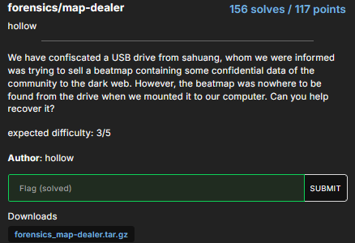
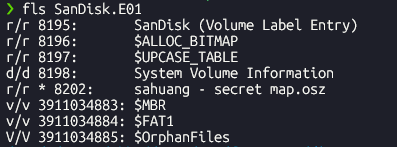

This is my writeup for the only forensics challenge `map dealer` in `osu ctf 2025` on Oct 24, 2025.

We are given an archive `forensics_map-dealer.tar.gz` with this description: `We have confiscated a USB drive from sahuang, whom we were informed was trying to sell a beatmap containing some confidential data of the community to the dark web. However, the beatmap was nowhere to be found from the drive when we mounted it to our computer. Can you help recover it?`

## What is The Sleuth Kit?
The Sleuth Kit (TSK), by Brian Carrier, is a collection of command line tools for disk images analyzing. It is extremely useful when it comes to recovering deleted files, which is the key to solving this challenge. 

Some of the common commands that are used in CTFs are `fls, mmls, icat, fsstat, dd`. 
For this challenge, we only need `fls` and `icat`.

## Data compression

`file SanDisk.E01` tells us that this is a disk image. 

First, we want to see what kind of file system does it have. [`fls`](https://www.sleuthkit.org/sleuthkit/man/fls.html) according to the manual, lists file and directory naems in a disk image.

