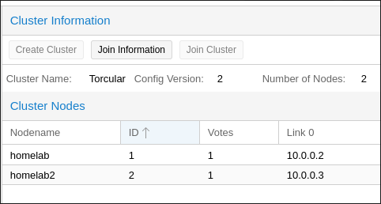

# Joining Proxmox Cluster

This weekend, I'm hitting the limit of my testing infrastructure. My set up was very humble. A Dell mini tower Micro Optiplex 7050 with only 16GB RAM and 256GB SSD. I mean, in this economy \<sigh\>. Luckily, I have an old laptop lying around and the next thought was creating a cluster of Promxox. Proxmox is no stranger to homelabbers for its uses in hosting VMs and containers. 

