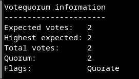
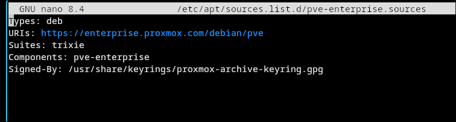
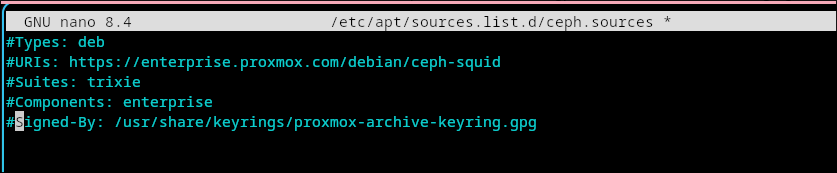

# Joining Proxmox Cluster

This weekend, I'm hitting the limit of my testing infrastructure. My set up was very humble. A Dell mini tower Micro Optiplex 7050 with only 16GB RAM and 256GB SSD. I mean, in this economy \<sigh\>. Luckily, I have an old laptop lying around and the next thought was creating a cluster of Proxmox. Proxmox is no stranger to homelabbers for its uses in hosting VMs and containers. 

Checklist before joining: 

- [ ] the nodes are time synced. Try to ping each other to check for connectivity. 
- [ ] the nodes have KVM hardware acceleration enabled 


## checking hardware acceleration extensions
run the command `egrep -c '(vmx|svm)' /proc/cpuinfo` on the nodes. 

VT-x  is Intel Virtualization Technology that is required for KVM to work. If it's not enabled yet, reboot the node, enter BIOS setup, enable it, save and reboot. 

Verity from your node `egrep -c '(vmx|svm)' /proc/cpuinfo`. 

## joining a cluster 
To join a cluster, we need a cluster. First, make sure you have a cluster created from an existing node. To do this, go to `Datacenter > Cluster > Create Cluster`. 


Copy the Joining Information from the existing node. Then visit the web UI of the new node. Go to `Datacenter > Cluster > Join Cluster` and paste the Joining Information. The node will need a reboot. After a minute, or 2, check on the node to see if it joined the cluster with this command `systemctl status pve-cluster corosync`. If the new node shows OK then the join succeeded, the web UI may need to be refreshed. 

On every node, run: `pvecm status` and you're expected to see results like this: 



## Disabling Proxmox enterprise repo 


Empty this file out. 

 


Then add 


update again `apt update` 

## Connectivity issue after installing Tailscale separately

The nodes could ping each other but corosync traffic did not see that. 

```bash
node1> pvecm status 


Votequorum information
----------------------
Expected votes:   2
Highest expected: 2
Total votes:      1
Quorum:           2 Activity blocked
Flags:            
```

### Troubleshooting 

```
node2> systemctl status corosync | tail -10 
Aug 08 20:21:56 homelab2 corosync[1076]:   [KNET  ] host: host: 1 has no active links
Aug 08 20:21:57 homelab2 corosync[1076]:   [TOTEM ] Token has not been received in 2250 ms
Aug 08 20:21:58 homelab2 corosync[1076]:   [TOTEM ] A processor failed, forming new configuration: tok>
Aug 08 20:22:01 homelab2 corosync[1076]:   [QUORUM] Sync members[1]: 2
Aug 08 20:22:01 homelab2 corosync[1076]:   [QUORUM] Sync left[1]: 1
Aug 08 20:22:01 homelab2 corosync[1076]:   [TOTEM ] A new membership (2.1e) was formed. Members left: 1
Aug 08 20:22:01 homelab2 corosync[1076]:   [TOTEM ] Failed to receive the leave message. failed: 1
Aug 08 20:22:01 homelab2 corosync[1076]:   [QUORUM] This node is within the non-primary component and >
Aug 08 20:22:01 homelab2 corosync[1076]:   [QUORUM] Members[1]: 2
Aug 08 20:22:01 homelab2 corosync[1076]:   [MAIN  ] Completed service synchronization, ready to provid>
root@homelab2:~# systemctl status corosync | tail -10
Aug 08 20:21:56 homelab2 corosync[1076]:   [KNET  ] host: host: 1 has no active links
Aug 08 20:21:57 homelab2 corosync[1076]:   [TOTEM ] Token has not been received in 2250 ms
Aug 08 20:21:58 homelab2 corosync[1076]:   [TOTEM ] A processor failed, forming new configuration: token timed out (3000ms), waiting 3600ms for consensus.
Aug 08 20:22:01 homelab2 corosync[1076]:   [QUORUM] Sync members[1]: 2
Aug 08 20:22:01 homelab2 corosync[1076]:   [QUORUM] Sync left[1]: 1
Aug 08 20:22:01 homelab2 corosync[1076]:   [TOTEM ] A new membership (2.1e) was formed. Members left: 1
Aug 08 20:22:01 homelab2 corosync[1076]:   [TOTEM ] Failed to receive the leave message. failed: 1
Aug 08 20:22:01 homelab2 corosync[1076]:   [QUORUM] This node is within the non-primary component and will NOT provide any services.
Aug 08 20:22:01 homelab2 corosync[1076]:   [QUORUM] Members[1]: 2
Aug 08 20:22:01 homelab2 corosync[1076]:   [MAIN  ] Completed service synchronization, ready to provide service.
```

```
systemctl status pve-cluster
● pve-cluster.service - The Proxmox VE cluster filesystem
     Loaded: loaded (/usr/lib/systemd/system/pve-cluster.service; enabled; preset: enabled)
     Active: active (running) since Sat 2026-08-08 11:32:24 EDT; 9h ago
 Invocation: d7f8af7697e04f11bd3e57af7d7ee9ea
   Main PID: 929 (pmxcfs)
      Tasks: 7 (limit: 23587)
     Memory: 65.5M (peak: 73M)
        CPU: 35.489s
     CGroup: /system.slice/pve-cluster.service
             └─929 /usr/bin/pmxcfs

Aug 08 20:22:01 homelab2 pmxcfs[929]: [status] notice: members: 2/929
Aug 08 20:22:01 homelab2 pmxcfs[929]: [status] notice: node lost quorum
Aug 08 20:22:01 homelab2 pmxcfs[929]: [dcdb] crit: received write while not quorate - trigger resync
Aug 08 20:22:01 homelab2 pmxcfs[929]: [dcdb] crit: leaving CPG group
Aug 08 20:22:02 homelab2 pmxcfs[929]: [dcdb] notice: start cluster connection
Aug 08 20:22:02 homelab2 pmxcfs[929]: [dcdb] crit: cpg_join failed: CS_ERR_EXIST
Aug 08 20:22:02 homelab2 pmxcfs[929]: [dcdb] crit: can't initialize service
Aug 08 20:22:08 homelab2 pmxcfs[929]: [dcdb] notice: members: 2/929
Aug 08 20:22:08 homelab2 pmxcfs[929]: [dcdb] notice: all data is up to date
Aug 08 20:32:23 homelab2 pmxcfs[929]: [dcdb] notice: data verification successful
```


The routing being used here is 
```
ip route get 10.0.0.2
10.0.0.2 dev tailscale0 table 52 src 100.114.150.26 uid 0 
    cache
```

meanwhile on node 1: 
```
ip route get 10.0.0.2
local 10.0.0.2 dev lo table local src 10.0.0.2 uid 0 
    cache <local>
```

This means Tailscale is taking over the routing table to intercept traffic to node 1. As a result, corosync lost its link -knet traffic to node 1 was going through Tailscale's tunnel instead of directly over `vmbr0`. 


The solution is stop node 2 from accepting that route: 
`tailscale up --accept-routes=false`

Verify: 
```
node2> ip route get 10.0.0.2
10.0.0.2 dev vmbr0 src 10.0.0.3 uid 0 
    cache
```

Confirm on node 1:
```
node1> pvecm status 
```

should give the result: 
```
Votequorum information
----------------------
Expected votes:   2
Highest expected: 2
Total votes:      2
Quorum:           2  
Flags:            Quorate
```


```
```
then restart corosync (optional) 
`systemctl restart corosync`


