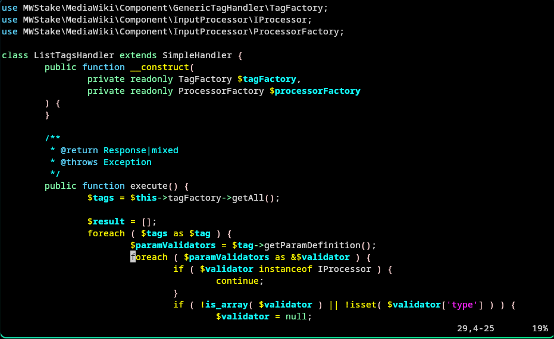
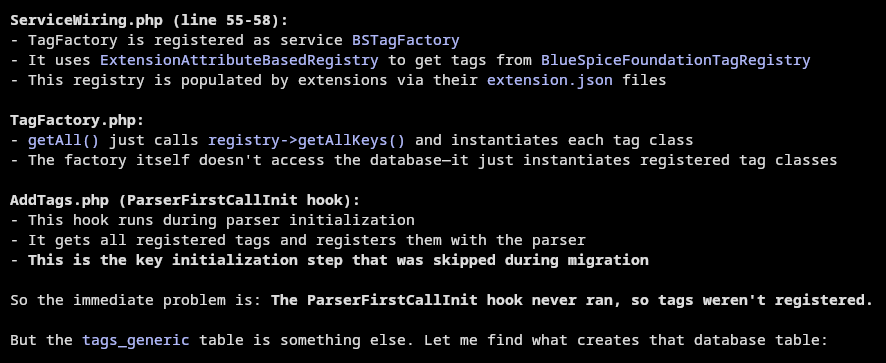
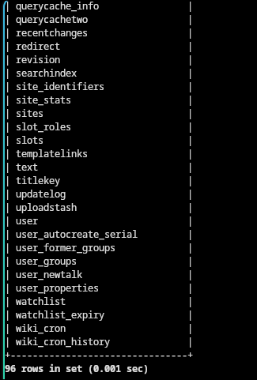

Migrating the database dump from MediaWiki 1.39 broke the schema generation. 

Current MediaWiki version 1.39.17 and BlueSpice 4.5.8

Good news is the `block` table is in the schema. We just have to import this table to the database. 
```
./bluespice-deploy exec wiki-web grep -n "CREATE TABLE.*block" /app/bluespice/w/maintenance/tables-generated.sql
grep: TABLE.*block: No such file or directory
/app/bluespice/w/maintenance/tables-generated.sql:5:CREATE TABLE /*_*/site_identifiers (
/app/bluespice/w/maintenance/tables-generated.sql:15:CREATE TABLE /*_*/updatelog (
/app/bluespice/w/maintenance/tables-generated.sql:22:CREATE TABLE /*_*/actor (
/app/bluespice/w/maintenance/tables-generated.sql:32:CREATE TABLE /*_*/user_former_groups (
/app/bluespice/w/maintenance/tables-generated.sql:39:CREATE TABLE /*_*/bot_passwords (
/app/bluespice/w/maintenance/tables-generated.sql:50:CREATE TABLE /*_*/comment (
/app/bluespice/w/maintenance/tables-generated.sql:60:CREATE TABLE /*_*/slots (
/app/bluespice/w/maintenance/tables-generated.sql:72:CREATE TABLE /*_*/site_stats (
/app/bluespice/w/maintenance/tables-generated.sql:84:CREATE TABLE /*_*/user_properties (
/app/bluespice/w/maintenance/tables-generated.sql:93:CREATE TABLE /*_*/log_search (
/app/bluespice/w/maintenance/tables-generated.sql:102:CREATE TABLE /*_*/change_tag (
/app/bluespice/w/maintenance/tables-generated.sql:119:CREATE TABLE /*_*/content (
/app/bluespice/w/maintenance/tables-generated.sql:129:CREATE TABLE /*_*/l10n_cache (
/app/bluespice/w/maintenance/tables-generated.sql:137:CREATE TABLE /*_*/module_deps (
/app/bluespice/w/maintenance/tables-generated.sql:145:CREATE TABLE /*_*/redirect (
/app/bluespice/w/maintenance/tables-generated.sql:156:CREATE TABLE /*_*/pagelinks (
/app/bluespice/w/maintenance/tables-generated.sql:169:CREATE TABLE /*_*/templatelinks (
/app/bluespice/w/maintenance/tables-generated.sql:182:CREATE TABLE /*_*/imagelinks (
/app/bluespice/w/maintenance/tables-generated.sql:194:CREATE TABLE /*_*/langlinks (
/app/bluespice/w/maintenance/tables-generated.sql:203:CREATE TABLE /*_*/iwlinks (
/app/bluespice/w/maintenance/tables-generated.sql:212:CREATE TABLE /*_*/category (
/app/bluespice/w/maintenance/tables-generated.sql:224:CREATE TABLE /*_*/watchlist_expiry (
/app/bluespice/w/maintenance/tables-generated.sql:232:CREATE TABLE /*_*/change_tag_def (
/app/bluespice/w/maintenance/tables-generated.sql:244:CREATE TABLE /*_*/ipblocks_restrictions (
/app/bluespice/w/maintenance/tables-generated.sql:253:CREATE TABLE /*_*/querycache (
/app/bluespice/w/maintenance/tables-generated.sql:262:CREATE TABLE /*_*/querycachetwo (
/app/bluespice/w/maintenance/tables-generated.sql:279:CREATE TABLE /*_*/page_restrictions (
/app/bluespice/w/maintenance/tables-generated.sql:294:CREATE TABLE /*_*/user_groups (
/app/bluespice/w/maintenance/tables-generated.sql:304:CREATE TABLE /*_*/querycache_info (
/app/bluespice/w/maintenance/tables-generated.sql:311:CREATE TABLE /*_*/watchlist (
/app/bluespice/w/maintenance/tables-generated.sql:326:CREATE TABLE /*_*/sites (
/app/bluespice/w/maintenance/tables-generated.sql:343:CREATE TABLE /*_*/user_newtalk (
/app/bluespice/w/maintenance/tables-generated.sql:352:CREATE TABLE /*_*/interwiki (
/app/bluespice/w/maintenance/tables-generated.sql:363:CREATE TABLE /*_*/protected_titles (
/app/bluespice/w/maintenance/tables-generated.sql:376:CREATE TABLE /*_*/externallinks (
/app/bluespice/w/maintenance/tables-generated.sql:390:CREATE TABLE /*_*/ip_changes (
/app/bluespice/w/maintenance/tables-generated.sql:400:CREATE TABLE /*_*/page_props (
/app/bluespice/w/maintenance/tables-generated.sql:411:CREATE TABLE /*_*/job (
/app/bluespice/w/maintenance/tables-generated.sql:437:CREATE TABLE /*_*/slot_roles (
/app/bluespice/w/maintenance/tables-generated.sql:445:CREATE TABLE /*_*/content_models (
/app/bluespice/w/maintenance/tables-generated.sql:453:CREATE TABLE /*_*/categorylinks (
/app/bluespice/w/maintenance/tables-generated.sql:469:CREATE TABLE /*_*/logging (
/app/bluespice/w/maintenance/tables-generated.sql:498:CREATE TABLE /*_*/uploadstash (
/app/bluespice/w/maintenance/tables-generated.sql:528:CREATE TABLE /*_*/filearchive (
/app/bluespice/w/maintenance/tables-generated.sql:572:CREATE TABLE /*_*/text (
/app/bluespice/w/maintenance/tables-generated.sql:580:CREATE TABLE /*_*/oldimage (
/app/bluespice/w/maintenance/tables-generated.sql:618:CREATE TABLE /*_*/objectcache (
/app/bluespice/w/maintenance/tables-generated.sql:629:CREATE TABLE /*_*/block (
/app/bluespice/w/maintenance/tables-generated.sql:652:CREATE TABLE /*_*/block_target (
/app/bluespice/w/maintenance/tables-generated.sql:678:CREATE TABLE /*_*/image (
/app/bluespice/w/maintenance/tables-generated.sql:714:CREATE TABLE /*_*/recentchanges (
/app/bluespice/w/maintenance/tables-generated.sql:758:CREATE TABLE /*_*/archive (
/app/bluespice/w/maintenance/tables-generated.sql:781:CREATE TABLE /*_*/page (
/app/bluespice/w/maintenance/tables-generated.sql:805:CREATE TABLE /*_*/user (
/app/bluespice/w/maintenance/tables-generated.sql:831:CREATE TABLE /*_*/user_autocreate_serial (
/app/bluespice/w/maintenance/tables-generated.sql:839:CREATE TABLE /*_*/revision (
/app/bluespice/w/maintenance/tables-generated.sql:860:CREATE TABLE /*_*/searchindex (
/app/bluespice/w/maintenance/tables-generated.sql:870:CREATE TABLE /*_*/linktarget (
```


Extract from lines 629-651 for table `block` and from lines 652 to 677 for table `block_target`. 

```
./bluespice-deploy exec wiki-web sed -n '629,651p' /app/bluespice/w/maintenance/tables-generated.sql | ./bluespice-deploy exec -T database mariadb cswiki

./bluespice-deploy exec wiki-web sed -n '652,677p' /app/bluespice/w/maintenance/tables-generated.sql | ./bluespice-deploy exec -T database mariadb cswiki
```


Then verify the tables exist in the database: 

```
MariaDB [cswiki]> show tables like 'block%';
+---------------------------+
| Tables_in_cswiki (block%) |
+---------------------------+
| block                     |
| block_target              |
+---------------------------+
2 rows in set (0.001 sec)
```

Then restart 
```
./bluespice-deploy down 
./bluepsice-deploy up -d 
```


TL;DR The database has all the pages but they won't display because tables like 'block' and 'block_target' were missing. Import these tables from the schema file `/app/bluespice/w/maintenance/tables-generated.sql` in  `bluespice-wiki-web` container. 

### Page is loading but Page Content isn't displaying 

Page record exists but no content linked to it. 

we need to check if the page has content in `content_blob`

The revision records weren't pointing to the right text IDs. 

#### Parser Cache Issue 

Parser Cache is a term coined by MediaWiki. It is one of the 2 cache types of MediaWiki rendered page output. 

Tags handler is crashing 

```
PHP Warning: foreach() argument must be of type array|object, null given
  at
  /app/bluespice/w/vendor/mwstake/mediawiki-component-generictaghandler/src/Rest/ListTagsHandler.php:29
```


GenericTagHandler is a vendor component/library used by BlueSpice, not an extension yo load with `wfLoadExtension()`. It's a dependency of BlueSpiceFoundation or another core BlueSpice extension. The component `generictaghandler` was trying to query the missing `tags_generic` table. 




the table that stores tags should be initialized by some BlueSpice script but it wasn't. 

it started with testing if we could edit the page with VisualEditor and we couldn't. We turned off VisualEditor to see if the hook/rendering issue still persisted. 

The empty page problem persisted after disabling the extension VisualEditor and its configs. 


```
- -  10/Aug/2026:00:44:18 +0000 "GET /w/rest.php" 200
- -  10/Aug/2026:00:44:18 +0000 "GET /w/api.php" 200
2026/08/10 00:44:18 [error] 42#42: *4 FastCGI sent in stderr: "PHP message: [2026-08-10T00:44:18.365402+00:00] error.ERROR: [5e1d3088b7f16e9fd046fcc2] /w/rest.php/mws/v1/tags   PHP Warning: foreach() argument must be of type array|object, null given {"exception":"[object] (ErrorException(code: 0): PHP Warning: foreach() argument must be of type array|object, null given at /app/bluespice/w/vendor/mwstake/mediawiki-component-generictaghandler/src/Rest/ListTagsHandler.php:29)","exception_url":"/w/rest.php/mws/v1/tags","reqId":"5e1d3088b7f16e9fd046fcc2","caught_by":"mwe_handler"} {"host":"03c82f03f177","wiki":"cswiki","mwversion":"1.43.8","reqId":"5e1d3088b7f16e9fd046fcc2"}; PHP message: [2026-08-10T00:44:18.366640+00:00] error.ERROR: [5e1d3088b7f16e9fd046fcc2] /w/rest.php/mws/v1/tags   PHP Warning: foreach() argument must be of type array|object, null given {"exception":"[

(ErrorException(code: 0): PHP Warning: foreach() argument must be of type array|object, null given at /app/bluespice/w/vendor/mwstake/mediawiki-component-generictaghandler/src/Rest/ListTagsHandler.php:29)","exception_url":"/w/rest.php/mws/v1/tags","reqId":"5e1d3088b7f16e9fd046fcc2","caught_by":"mwe_handler"} {"host":"03c82f03f177","wiki":"cswiki","mwversion":"1.43.8","reqId":"5e1d3088b7f16e9fd046fcc2"}; PHP message: [2026-08-10T00:44:18.371577+00:00] error.ERROR: [5e1d3088b7f16e9fd046fcc2] /w/rest.php/mws/v1/tags   PHP Warning: foreach() argument must be of type array|object, null given {"exception":"[object] (ErrorException(code: 0): PHP Warning: foreach() argument must be of type array|object, null given at /app/bluespice/w/vendor/mwstake/mediawiki-component-generictaghandler/src/Rest/ListTagsHandler.php:29)","exception_url":"/w/rest.php/mws/v1/tags","reqId":"5e1d3088b7f16e9fd046fcc2","caught_by":"mwe_handler"} {"host":"03c82f03f177","wiki":"cswiki","mwversion":"1.43.8","reqId":"5e1d3088b7f16e9fd046fcc2"}; PHP message: [2026-08-10T00:44:18.380648+00:00] error.ERROR: [5e1d3088b7f16e9fd046fcc2] /w/rest.php/mws/v1/tags   PHP Warning: foreac
- -  10/Aug/2026:00:44:18 +0000 "GET /w/rest.php" 200
172.18.0.2 - - [10/Aug/2026:00:44:18 +0000] "GET /w/rest.php/mws/v1/tags HTTP/1.1" 200 5191 "http://10.0.0.220/wiki/Main_Page?action=edit" "Mozilla/5.0 (X11; Linux x86_64; rv:153.0) Gecko/20100101 Firefox/153.0"
```


An endpoint `/w/rest.php/mws/v1/tags` kept being called. 
It was called by the VisualEditorPlus extension. VisualEditorPlus was loaded because i forgot to disable it even though I disabled VisualEditor. 

```
 grep -r "mws/v1/tags" /app/bluespice/w/extensions | head -5
/app/bluespice/w/extensions/VisualEditorPlus/resources/ext.visualEditorPlus.tags.js:		url: mw.util.wikiScript( 'rest' ) + '/mws/v1/tags',
```





after a night of debugging, I found workaround that is to update it to 1.41 first. 


## installing core mediawiki 1.43

find the latest tarball from https://releases.wikimedia.org/mediawiki/1.43/ 


## installing bluespice 5.2.6 

Hardware requirement:
RAM: at least 8GiB
CPU: 8 cores
Disk storage: at least 20GB 

install docker engine, git on the machine. 
clone the repo of bluespice-deploy `git clone `

```
cd bluespice-deploy/compose/
```

create the data directory `/data/bluespice/` 

create `.env` and spin up the docker stack using the wrapper `./bluespice-deploy up -d`. 

```
 docker exec -i bluespice-database mariadb -h 127.0.0.1 -P 3306 -u bluespice -pwikipass cswiki < cswiki_1439_export.sql
--------------
/*!50001 CREATE ALGORITHM=UNDEFINED */
/*!50013 DEFINER=`bluespice_user`@`localhost` SQL SECURITY DEFINER */
/*!50001 VIEW `dpl_clview` AS select ifnull(`cswiki`.`categorylinks`.`cl_from`,`cswiki`.`page`.`page_id`) AS `cl_from`,ifnull(`cswiki`.`categorylinks`.`cl_to`,'') AS `cl_to`,`cswiki`.`categorylinks`.`cl_sortkey` AS `cl_sortkey` from (`page` left join `categorylinks` on(`cswiki`.`page`.`page_id` = `cswiki`.`categorylinks`.`cl_from`)) */
--------------

ERROR 1227 (42000) at line 2762: Access denied; you need (at least one of) the SET USER privilege(s) for this operation
```

i tried to dump the database as a user, not root. Because the dump included a VIEW that was defined with DEFINER clause. A DEFINER clause in MariaDB gives a user account the ownership of objects in the database. 

we can strip away this clause from the dump. 
`sed -i -E 's/DEFINER=`[^`]+`@`[^`]+`//g' cswiki_1439_export.sql`


`docker exec -i bluespice-database mariadb -h 127.0.0.1 -P 3306 -u bluespice -pwikipass cswiki < cswiki_1439_export.sql`



96 tables in the database before loading any extension. 

i think the order of doing this matters. You should try to import the database before loading the extensions first just to make sure the maintenance scripts are able to fix the schema. For some reasons, if you do it the other way around, the maintenance scripts won't be able to fix the schema. 
```
show tables;
+--------------------------------+
| Tables_in_cswiki               |
+--------------------------------+
| actor                          |
| archive                        |
| block                          |
| block_target                   |
| bot_passwords                  |
| bs_dashboards_configs          |
| bs_editnotifyconnector         |
| bs_extendedsearch_history      |
| bs_extendedsearch_relevance    |
| bs_extendedsearch_trace        |
| bs_extendedstatistics_snapshot |
| bs_pageassignments             |
| bs_pagetemplate                |
| bs_privacy_request             |
| bs_readers                     |
| bs_saferedit                   |
| bs_settings3                   |
| bs_usagetracker                |
| bs_whoisonline                 |
| category                       |
| categorylinks                  |
| change_tag                     |
| change_tag_def                 |
| comment                        |
| content                        |
| content_models                 |
| dpl_clview                     |
| echo_email_batch               |
| echo_event                     |
| echo_notification              |
| echo_push_provider             |
| echo_push_subscription         |
| echo_target_page               |
| externallinks                  |
| filearchive                    |
| hit_counter                    |
| hit_counter_extension          |
| image                          |
| imagelinks                     |
| interwiki                      |
| invitesignup                   |
| ip_changes                     |
| ipblocks_restrictions          |
| iwlinks                        |
| job                            |
| l10n_cache                     |
| langlinks                      |
| ldap_domains                   |
| linktarget                     |
| log_search                     |
| logging                        |
| module_deps                    |
| mws_category_index             |
| mws_title_index                |
| mws_user_index                 |
| mwstake_dynamic_config         |
| notifications_event            |
| notifications_instance         |
| notifications_web_query_store  |
| oathauth_users                 |
| objectcache                    |
| oldimage                       |
| page                           |
| page_props                     |
| page_restrictions              |
| pagelinks                      |
| process_plugin_lock            |
| processes                      |
| protected_titles               |
| querycache                     |
| querycache_info                |
| querycachetwo                  |
| recentchanges                  |
| redirect                       |
| revision                       |
| searchindex                    |
| site_identifiers               |
| site_stats                     |
| sites                          |
| slot_roles                     |
| slots                          |
| templatelinks                  |
| text                           |
| titlekey                       |
| updatelog                      |
| uploadstash                    |
| user                           |
| user_autocreate_serial         |
| user_former_groups             |
| user_groups                    |
| user_newtalk                   |
| user_properties                |
| watchlist                      |
| watchlist_expiry               |
| wiki_cron                      |
| wiki_cron_history              |
+--------------------------------+
96 rows in set (0.001 sec)
```


#### pre & post-init-settings.php 

these are the final bosses of this challenge. 


##### extensions
after we have the extensions downloaded in `/data/bluespice/wiki/extensions/`, we need to load it in `post-init-settings.php` and mount the extensions directory into the container's actual path via compose override: 

```
services:
  wiki-web:
    volumes:
      - ${DATADIR}/wiki:/data
      - ${DATADIR}/wiki/extensions/:/app/bluespice/w/extensions/
  wiki-task:
    volumes:
      - ${DATADIR}/wiki:/data
      - ${DATADIR}/wiki/extensions/:/app/bluespice/w/extensions/

```

`./bluespice-deploy exec wiki-task php /app/bluespice/w/maintenance/run.php update --quick`


```
stat extensions/BlueSpiceDashboards/extension.json 
  File: extensions/BlueSpiceDashboards/extension.json
  Size: 5056      	Blocks: 16         IO Block: 4096   regular file
Device: 8,4	Inode: 109107464   Links: 1
Access: (0644/-rw-r--r--)  Uid: ( 1002/ UNKNOWN)   Gid: ( 1002/ UNKNOWN)
Context: unconfined_u:object_r:user_home_t:s0
Access: 2026-08-10 20:47:11.106332475 +0000
Modify: 2026-08-10 20:47:11.107332468 +0000
Change: 2026-08-10 20:53:44.821446942 +0000
 Birth: 2026-08-10 20:47:11.106332475 +0000
```


```
getenforce
Enforcing
```


temporary fix: 
```
sudo chcon -R -t container_file_t /data/bluespice
```
`chcon` can't change the underlying SELinux policy. Any changes made with `chcon` will be overwritten or revert back to the defaults whenever the system is relabeled or when `restorecon` command is executed. 

To make it persistent, we have to write the rule directory to the SELinux policy with `semanage` and apply it. you may have to install `semanage` first with command `sudo dnf install policycoreutils-python-utils`. 

```
sudo semanage fcontext -a -t container_file_t '/data/bluespice(/.*)?'
sduo restorecon -Rv /data/bluespice/
```

Don't worry if you have the warnings that `not reset as customized by admin to unconfined_u:object_r:container_file_t:s0`. this means that these files were already labeled from the `chcon` command earlier. 

restart the containers. 


### Images not display

This part only applies if you want to use NSFileRepo for MediaWiki1.43

Since the images were structured by this extension. It's worrisome if we want to move to >MediaWiki1.43. 

MediaWiki can handle the images, but it uses MD5 hashes for strucutring the images, which would confuse the database. 

This is an obvious technical debt, and further research needs to be put into this.


`nsfr_img_auth.php` is the key here. It is a direct HTTP entrypoint so it needs to be under the same parent directory as `index.php`, i.e., it sits here `/app/bluespice/w/nsfr_img_auth.php` inside the wiki-web container.

`docker exec bluespice-wiki-web ls -la /app/bluespice/w/nsfr_img_auth.php` to check if `nsfr_img_auth.php` is at the correct path.

an approach for this is bind-mounting the file under the extensions directory using the override file:

```
services:
  wiki-web:
    volumes:
      - ${DATADIR}/wiki/extensions/NSFileRepo/nsfr_img_auth.php:/app/bluespice/w/nsfr_img_auth.php
      - ${DATADIR}/wiki/extensions/:/app/bluespice/w/extensions/
  wiki-task:
    volumes:
      - ${DATADIR}/wiki/extensions/NSFileRepo/nsfr_img_auth.php:/app/bluespice/w/nsfr_img_auth.php
      - ${DATADIR}/wiki/extensions/:/app/bluespice/w/extensions/
```


